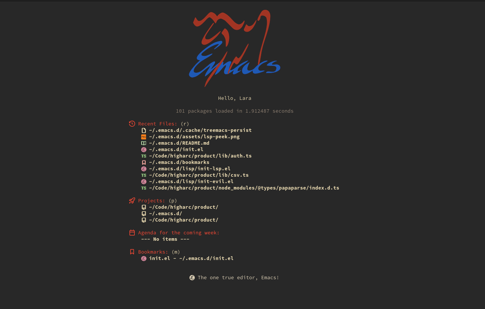
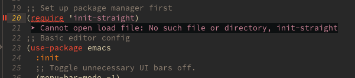
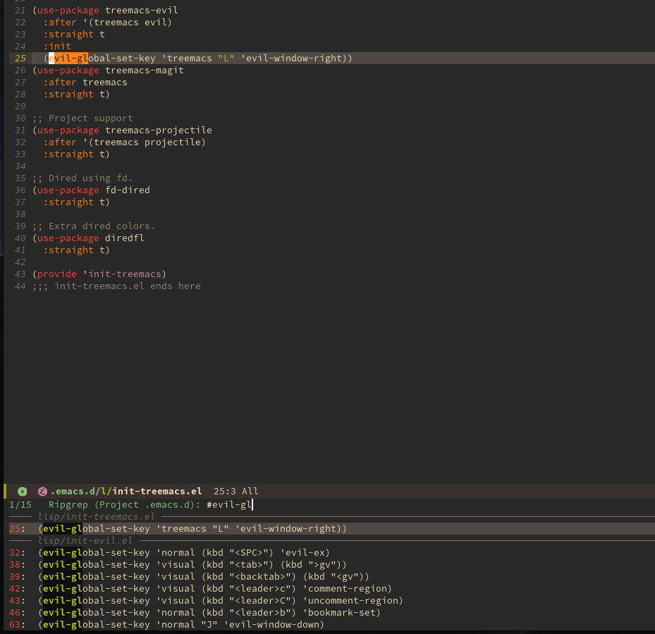
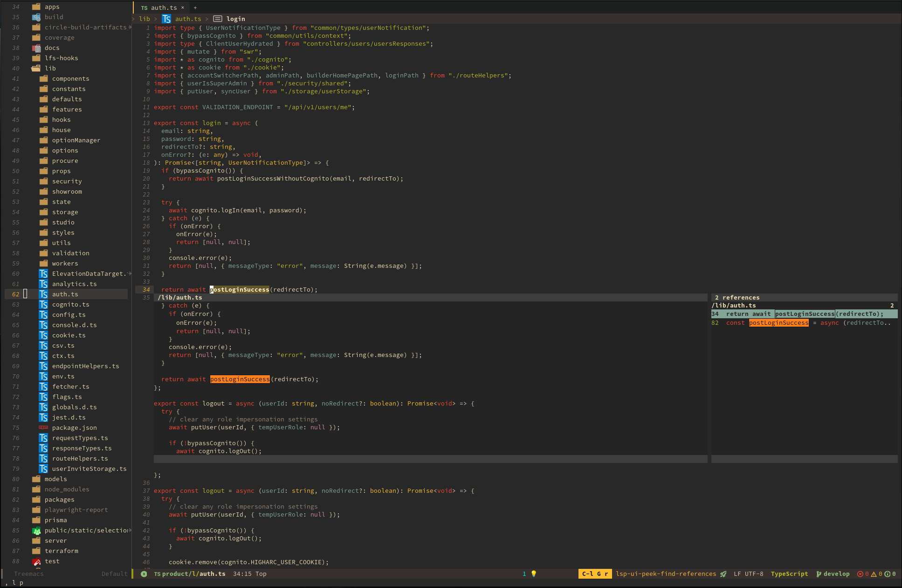

# emacs.d

> An IDE-like Emacs configuration for users more comfortable with Vim/Neovim.

---

## Dependencies

- Emacs 29.4+
- `multimarkdown` for Markdown preview/compilation
   - Can be installed from most system package managers

## Setup

### Before you launch Emacs

1. Clone this repo into `~/.emacs.d`
2. Update env vars or add more in `early-init.el`

### First launch

1. Launch Emacs and wait a bit for everything to install (only once)
2. Run `nerd-icons-install-fonts` (only needed once)
3. Run `treesit-auto-install-all` to install Treesitter grammars all at once (optional)
4. Run `copilot-install-server` to install Copilot
5. As you navigate to `lsp-mode`-enabled files, you should get prompted (only once) to install
   a language server

## Keybindings

Note that I was a longtime Vim/Neovim user (10 years!), and the keybindings
here are meant to mostly mirror my old setup in that editor. Edit `init-keys.el`
as you see fit to change any keybindings.

The guiding philosophy is to lean on the `<leader>` key as much as possible,
and to "namespace" command groups. For example, `<leader>d` is my prefix for
all debugging (`dap-mode`) keybindings. `<leader>db` shows breakpoints, for instance.

## Theme

Default theme is `gruvbox`, provided by `doom-themes`. Edit `init-theme.el` to change this.

## Completion and help

The following packages are relied on for solid help, documentation, and
completion behavior:

- `embark`
- `vertico`
- `consult`
- `which-key`
- `marginalia`
- `corfu`
- `orderless`

I'm still adjusting to these packages and the configuration may change as I
learn to get everything synthesized nicely. In addition, `lsp-mode` will provide
more help and navigation tools for language modes where it is enabled.

## Navigation

Navigation is also guided by Vim principles. In general, move around with `hjkl`,
use `<shift>-[hjkl]` to move between windows and the mini-buffer, and `<shift>-[ui]`
to move between tabs (see below).

### Tabs

Tabs are managed by `centaur-tabs`. It takes some getting used to, but provides a
nicely organized experience. Tabs are grouped by project / category. Use the left
and right arrow keys to move between tab groups.

### Tree view

A tree view of files is provided by Treemacs, and integrates with `lsp-mode` to
allow for rich display of errors, symbols, and more.

## Language grammars

This config includes some Tree-sitter mappings to allow for standard Vim
text manipulation and navigation tools with real language constructs.

For example, just like `yiw` means "yank in word", `yif` means "yank in function"
when supported. Pretty cool!

## Git

I use `magit` for a nice Git user interface. It will pull `TODO` comments out
into a list as well.

## Org mode

I have a minimal but evolving Org configuration, as I'm still learning it.

## Gotchas and annoyances

You might consider tweaking the following:

- Disabling `keycast-mode` by default in the mode line
- Removing `centaur-tabs` in favor of more standard viewing and navigation of buffers
- Removing `copilot`

If you don't want to use Evil or all of the `<leader>`-based mappings, you can rip
that stuff out, but at that point you may want to consider a less Vim-centric Emacs
config.

## Screenshots

**Start screen with emacs-dashboard**

**Flymake at-point diagnostics**

**Consult + ripgrep with previews**

**Peek references in lsp-mode**

## Copyright

Copyright (c) 2024 Lara Kelley. Use with credit.
